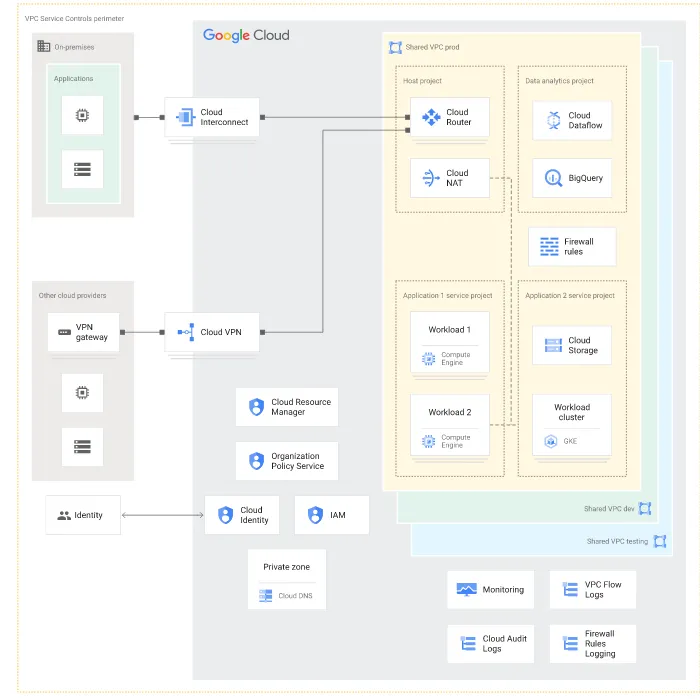
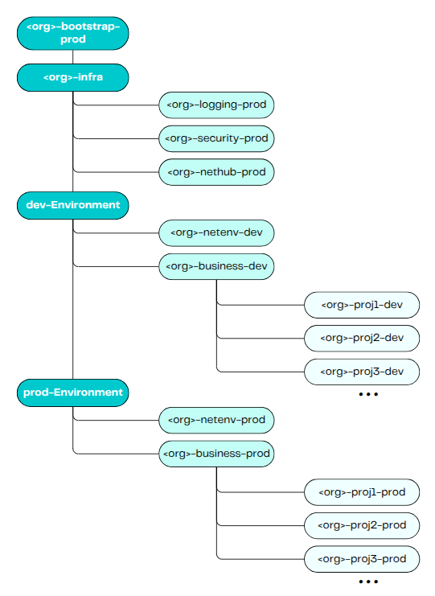

# Documentação

## Sobre o LandingZone do GCP

## Pré-Requisitos de Software e de Organização para executar um Landingzone

Para realizar um Landingzone de forma eficiente são necessárias as seguintes intalações(todas tecnologias listadas recomenda-se a versão mais recente e estável):
- Google Cloud SDK;
- Terraform;
- Git.

Além do mais, são necessários os seguintes pré-requisitos no GCP:
- Organização no Google Cloud;
- Billing Account;
- Configurar um Cloud Identity. Também é possível gerenciar um grupo pelo Workspace;
- Algumas roles importantes para um grupo de usuários, caso seja necessário:
  <b>
  - roles/resourcemanager.projectCreator
  - roles/resourcemanager.folderCreator 
  - roles/resourcemanager.organizationAdmin
  - roles/billing.admin.
  </b>

- Service Account.

## Componentes Essenciais para um LandingZone no GCP

- <b>Hierarquia Organizacional</b>: Hierarquia organizacional, distribuição de pastas e projetos, associando-se a  políticas robustasm são medidas essenciais para um gerenciamento eficiente de recursos. Se modelado e executado corretamente, será possível manter o controle e a visibilidade acima dos recursos utilizados no projeto. 
- <b>Identity and Access Management (IAM)</b>: Utilizando o Cloud Identity, é possível gerenciar manualmente o acesso dos usuários, reforçando medidas de segurança e simplificando a autenticação
- <b>Arquitetura da Rede</b>: Topologias típicas, como Rede Compartilha, ou Shared VPC (criada para cada de ambiente, como Produção, Teste, Homologação), VPN, NAT (para habilitar acesso externo), além da definição do firewall (assegurar a conectividade para os fluxos de trabalho, além de proteger os acessos). A boa modelagem da arquitetura de rede é uma peça essencial para um landzone.
- <b>Segurança e Compliance</b>: 
- <b>Monitoramento e Logs</b>: Ferramentas como Cloud Monitoring e Cloud Logging auxiliam no processo de acompanhamento do recurso. É possível também utilizar o Cloud Trace (antigo StackDriver) para obter dados a respeito de latência em requisições para serviços, e requisições entre serviços.

  

## Estrutura Funcional parte a parte do LandingZone

O diagrama estrutural a nível de aplicação foi modelado com aspectos generalistas a serem escalados de acordo com a evolução do modelo. Mais abaixo os tópicos são aboardados e aprofundados. Esta é uma representação de um modelo Organizacional.

### Design de Organização

  

### Bootstrap

Este projeto representa o Bootstrap do ambiente, que em suma será responsável pela organização e configurações iniciais do GCP(políticas iniciais da organização, hierarquia de pastas, entre outros), além de guardar algumas variáveis secretas, como id's dos projetos, billing account, id da organização.

É importante salientar que as estruturas secretas precisam ser armazenadas em "envs", ignorando seus commits à estrutura principal (utilizando o .gitignore é possível fazer isso), para evitar vazamentos de informações. 

### Infra

Essa divisão representa a pasta que agrupará os projetos da infraestrutura compartilhada da organização, que são replicados em cada outro ambiente. Ou seja, as determinações descritas nesta divisão vão cobrir a estrutura dos outros ambientes(dev e prod).

Fazem parte da Infraestrutura:

- <b>Logging</b>: Vai determinar a parte central dos projetos para Logs e monitoramento do GCP. Neste ponto, podem ser interessantes as adições do Cloud Logging, Cloud Monitoring e Cloud Trace.

- <b>Security</b>: Vai determinar a parte central dos serviços de segurança presentes na estrutura geral. Neste ponto, são interessantes políticas de utilização do ambiente. Externamente, a adição do Cloud Armor é essencial para evitar ataques cibernéticos e tornar mais robusta a infraestrutura da organização.

- <b>Nethub</b>: Vai construir toda a rede da organização, baseado principalmente em Shared VPC e roteadores. Adicionalmente, serve como hub da malha de rede, como VPC Peering, Interconnect, entre outros.

### dev-Environment e prod-Environment

São divisões semelhantes, com a simples deferença em seu posicionamento na esteira de desenvolvimento: desenvolvimento e produção. Neste contexto, temos:

- <b>netenv</b>: Aqui são determinar os projetos que se envolvem diretamente com a rede. Eles vão servir e suportar os projetos contidos na camada de business tratando, principalmente, questões de conectividade. 

- <b>business</b>: Esta divisão vai conter os projetos relacionados aos serviços prestados pela organização, no domnímio de aplicação. Aqui estão relacionados os Apps, API's, funções, entre outros. Tais projetos são descritos como projx-dev/prod. No diagrama esses projetos foram numerados, mas são escaláveis de acordo com o catálogo de serviços da organização.

## Links úteis

<la>
    <li><a href="https://medium.com/google-cloud/hands-on-gcp-landing-zone-with-terraform-code-44393a776139">Landing zone design in Google Cloud: Hands-on Demo with Terraform<a>
    <ul style="text-decoration: none; color: white;">Construção de um Landing Zone no GCP utilizando arquitetura modular.</ul></li>
    <li><a href="https://github.com/ollionorg/gcp-landing-zone">GCP-landing-zone<a>
    <ul style="text-decoration: none; color: white;">Repositório com implementação de um landingzone. No atual momento, este repositório não recebeu mais atualizações, são 1 ano e alguns meses sem novas implementações. Necessário realizar testes para verificar possíveis falhas de segurança.</ul></li>
    <li><a href="https://medium.com/google-cloud/your-first-step-in-google-cloud-platform-building-a-landing-zone-with-terraform-d9fe764edbcb">Your First Step in Google Cloud Platform : Building a Landing Zone with Terraform<a>
    <ul style="text-decoration: none; color: white;">Artigo com princípios fundamentais de uma Landzone, voltado para o GCP com Terraform. Mais introdutório.</ul></li>
    <li><a href="https://medium.com/google-cloud/everything-about-google-cloud-landing-zone-19ccd90af844">Everything About Google Cloud Landing Zone <a><ul style="text-decoration: none; color: white;">Artigo com princípios fundamentais de uma Landzone, com conceitos técnicos, voltado para o GCP.</ul></li>
    <li><a href="https://developer.hashicorp.com/terraform/docs">Terraform Documentation<a> <ul style="text-decoration: none; color: white;">Documentação do Terraform.</ul></li>
    <li><a href="https://github.com/terraform-google-modules/terraform-example-foundation">Terraform-example-foundation<a> <ul style="text-decoration: none; color: white;">Exemplo da Google de melhores práticas e performance para um Landingzone.</ul></li>

    
</la>

